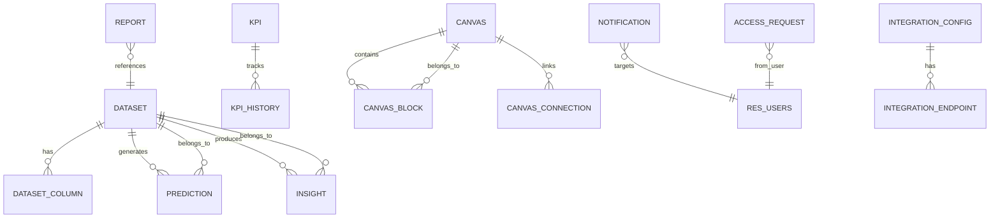

# OptimaAI — Architecture Guide

> Comprehensive technical reference for contributors. Updated: March 2026.

---

## 1. Module Overview

OptimaAI is a **full-stack Odoo 19 module** providing AI-powered business intelligence within the Odoo ecosystem. It runs as a single monorepo where Python backend (data models, controllers) and JavaScript frontend (OWL components, SCSS) deploy together.

```
optimaai/
├── __manifest__.py          # Module manifest (deps, assets, data files)
├── __init__.py              # Python package init
├── models/                  # 16 Python models (ORM)
├── controllers/             # HTTP controllers (JSON-RPC + REST API)
├── views/                   # Odoo XML views + menus
├── security/                # Groups, ACLs
├── static/src/              # Frontend assets (JS, SCSS, XML templates)
│   ├── js/optimaai.js       # OWL components
│   ├── scss/                # Styles (optimaai.scss + theme overrides)
│   └── xml/                 # QWeb templates
├── data/                    # Default data, sequences, website pages
├── demo/                    # Demo data (loaded in demo mode only)
├── services/                # Python service layer
├── wizard/                  # Odoo wizards (transient models)
└── tests/                   # Unit tests
```

---

## 2. Data Model Architecture

### Entity Relationship Diagram



### Model Catalog

| Model | File | Purpose | Key Fields |
|---|---|---|---|
| `optimaai.dataset` | `dataset.py` | Data file management | `status`, `row_count`, `column_count`, `quality_score`, `file_data` |
| `optimaai.dataset.column` | `dataset_column.py` | Column metadata per dataset | `dataset_id`, `column_type`, `null_count` |
| `optimaai.prediction` | `prediction.py` | AI prediction jobs | `dataset_id`, `prediction_type`, `status`, `result_data`, `confidence` |
| `optimaai.insight` | `insight.py` | AI-generated findings | `dataset_id`, `insight_type`, `priority`, `action_status`, `summary` |
| `optimaai.kpi` | `kpi.py` | Performance metrics | `current_value`, `target_value`, `unit`, `category`, `status`, `trend` |
| `optimaai.kpi.history` | `kpi.py` | KPI value snapshots | `kpi_id`, `value`, `recorded_at` |
| `optimaai.report` | `report.py` | Generated reports | `report_type`, `format`, `file_data`, `dataset_id` |
| `optimaai.canvas` | `canvas.py` | Visual workflow boards | `block_ids`, `connection_ids`, `is_published` |
| `optimaai.canvas.block` | `canvas_block.py` | Canvas visual elements | `canvas_id`, `block_type`, `position_x/y`, `config_json` |
| `optimaai.canvas.connection` | `canvas_connection.py` | Links between blocks | `canvas_id`, `source_block_id`, `target_block_id` |
| `optimaai.notification` | `notification.py` | User notifications | `title`, `message`, `notification_type`, `is_read` |
| `optimaai.integration.config` | `integration_config.py` | External integrations | `provider`, `api_key`, `webhook_url` |
| `optimaai.integration.endpoint` | `integration_config.py` | Integration endpoints | `config_id`, `method`, `url_path` |
| `optimaai.access.request` | `access_request.py` | Access requests | `user_id`, `model_name`, `status` |
| `res.users.api.key` | `res_users_api_key.py` | REST API keys | `user_id`, `key`, `is_active` |

### Security Mixins

| Mixin | Purpose |
|---|---|
| `optimaai.security.mixin` | Base security: company filtering + owner tracking |
| `optimaai.own.record.mixin` | Restricts records to owner only |
| `optimaai.company.record.mixin` | Multi-company record isolation |

---

## 3. Controller Architecture

All controllers live in `controllers/main.py` and `controllers/website.py`.

### JSON-RPC Endpoints (Internal — OWL Frontend)

These are called by the OWL JavaScript via `rpc()`. Auth: Odoo session (`auth='user'`).

| Endpoint | Method | Purpose |
|---|---|---|
| `/optimaai/dashboard/data` | JSON | Main dashboard data (counts, KPIs, insights) |
| `/optimaai/notifications/count` | JSON | Unread notification badge count |
| `/optimaai/notifications/list` | JSON | Paginated notification list |
| `/optimaai/notifications/mark_read` | JSON | Mark single notification read |
| `/optimaai/notifications/mark_all_read` | JSON | Mark all notifications read |
| `/optimaai/canvas/load` | JSON | Load canvas blocks for rendering |
| `/optimaai/dataset/preview` | JSON | Dataset row preview |
| `/optimaai/rpc/*` | JSON | 8 additional data endpoints |

### REST API Endpoints (External)

Protected by `X-API-Key` header. Used by external systems and the standalone frontend.

| Resource | List | Read | Create | Update | Delete |
|---|---|---|---|---|---|
| Datasets | `GET /api/v1/datasets` | `GET /api/v1/datasets/<id>` | `POST` | `PUT` | `DELETE` |
| Predictions | `GET /api/v1/predictions` | `GET /api/v1/predictions/<id>` | `POST` | — | `DELETE` |
| Insights | `GET /api/v1/insights` | `GET /api/v1/insights/<id>` | — | `PUT` | `DELETE` |
| KPIs | `GET /api/v1/kpis` | `GET /api/v1/kpis/<id>` | `POST` | `PUT` | `DELETE` |

### Website Controller

| Route | Purpose |
|---|---|
| `/optimaai/public-dashboard` | Public-facing QWeb dashboard page |

---

## 4. Frontend Architecture

### Technology Stack

| Layer | Technology |
|---|---|
| Components | **OWL** (Odoo Web Library) — class-based, reactive |
| Templates | **QWeb** (XML) |
| Styling | **SCSS** (compiled by Odoo asset pipeline) |
| Charts | **Chart.js 4.x** (loaded dynamically from CDN) |
| State | `useState()` reactive state objects |
| RPC | `rpc()` from `@web/core/network/rpc` |

### OWL Component Map

```
optimaai.js
├── NotificationBell          # Systray widget (notification count + dropdown)
├── KPICard                   # Individual KPI card (used in list views)
├── InsightCard               # Insight card with priority badge
├── CanvasDashboard           # Visual workflow canvas
└── OptimaAIDashboard         # Main dashboard (client action)
    ├── Metric strip (7 colored KPI cards)
    ├── Charts row (3 Chart.js panels)
    ├── KPI performance table
    ├── Active insights grid
    └── Quick actions
```

### Asset Pipeline

Assets are declared in `__manifest__.py` → `assets` key:

| Bundle | Files | When Loaded |
|---|---|---|
| `web.assets_backend` | `optimaai.js`, `optimaai.scss`, `optimaai_templates.xml` | Odoo backend (web client) |
| `web._assets_primary_variables` | `primary_variables.scss` | Before Bootstrap compilation |
| `web._assets_frontend_helpers` | `bootstrap_overridden.scss` | After primary vars, before Bootstrap |
| `web.assets_frontend` | `font.scss`, `theme.scss` | Public website pages |

### Dashboard Data Flow

```
┌─────────────┐    JSON-RPC     ┌───────────────┐    ORM     ┌──────────┐
│  OWL        │───────────────▶ │  Controller   │──────────▶ │  Models  │
│  Component  │                 │  (main.py)    │            │  (ORM)   │
│             │◀─ JSON ─────── │               │◀───────── │          │
└──────┬──────┘                 └───────────────┘            └──────────┘
       │
       ▼
┌──────────────┐
│  Chart.js    │  (Dynamic CDN load)
│  Rendering   │
└──────────────┘
```

---

## 5. Security Architecture

### Groups (defined in `security/security.xml`)

| Group | XML ID | Access Level |
|---|---|---|
| OptimaAI User | `optimaai.group_optimaai_user` | Read + create records |
| OptimaAI Manager | `optimaai.group_optimaai_manager` | Full CRUD + config |

### ACLs (defined in `security/ir.model.access.csv`)

Every model has ACL entries for both User and Manager groups. Manager gets full CRUD; User typically gets read + create.

### API Authentication

External REST API uses `X-API-Key` header → validated against `res.users.api.key` model → maps to an Odoo user for permission checking.

---

## 6. Key Design Decisions

| Decision | Rationale |
|---|---|
| **Monorepo Odoo module** | Single deploy, leverages Odoo auth/menus/mail |
| **OWL over legacy JS** | Odoo 19 standard, reactive, no `odoo.define` |
| **Chart.js from CDN** | Avoids bundling 200KB lib in Odoo assets |
| **JSON-RPC for dashboard** | Leverages Odoo session auth, no CORS issues |
| **REST API for external** | Enables standalone frontend connection later |
| **read_group for aggregation** | Efficient SQL-level grouping via ORM |

---

## 7. File Dependencies & Load Order

The manifest enforces this load order for data files:

```
1. security/security.xml          ← Groups (referenced by everything)
2. security/ir.model.access.csv   ← ACLs (reference groups)
3. data/sequence_data.xml         ← Sequences (used by models)
4. data/default_kpi_data.xml      ← Default KPIs
5. data/pages/dashboard.xml       ← Website QWeb pages
6. views/*_views.xml              ← All entity views
7. views/menu_views.xml           ← Menus (MUST be last — references actions)
```

> [!CAUTION]
> `menu_views.xml` must always be loaded last. It references `ir.actions.act_window` IDs defined in the other view files. Moving it earlier will cause `ValueError: External ID not found`.

---

## 8. Future Architecture (Standalone Frontend)

The module is designed to support a future 3-tier architecture:

```
┌─────────────┐     ┌──────────────┐     ┌──────────────┐
│   Frontend   │────▶│   Backend    │────▶│  Odoo (Data)  │
│  React/Next  │     │ FastAPI/Node │     │  Models only  │
│  (Repo 2)    │     │ AI/ML Logic  │     │  REST API     │
└─────────────┘     └──────────────┘     └──────────────┘
```

The REST API (`/api/v1/*`) already provides the data access layer. When migrating, the Odoo module becomes a thin data connector, and the standalone frontend consumes the API.
